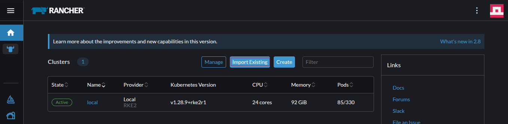
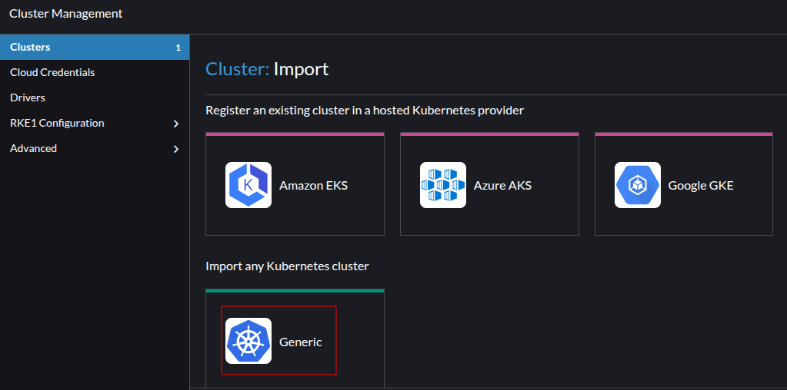
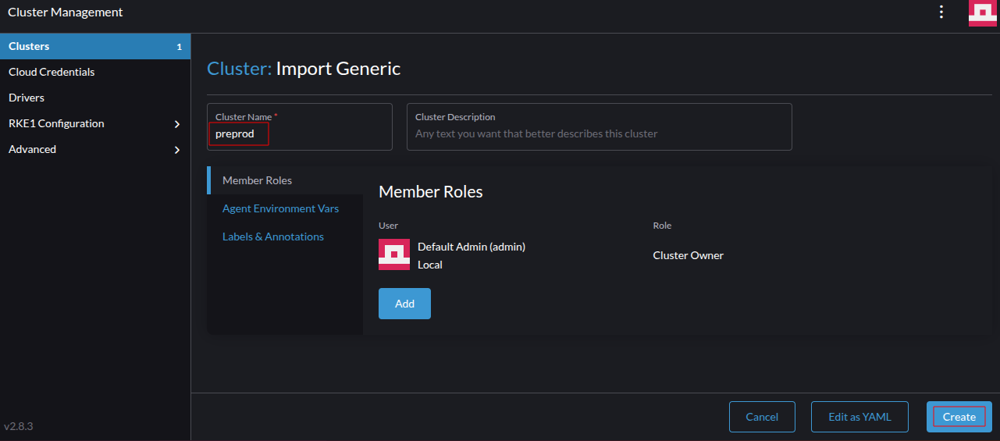
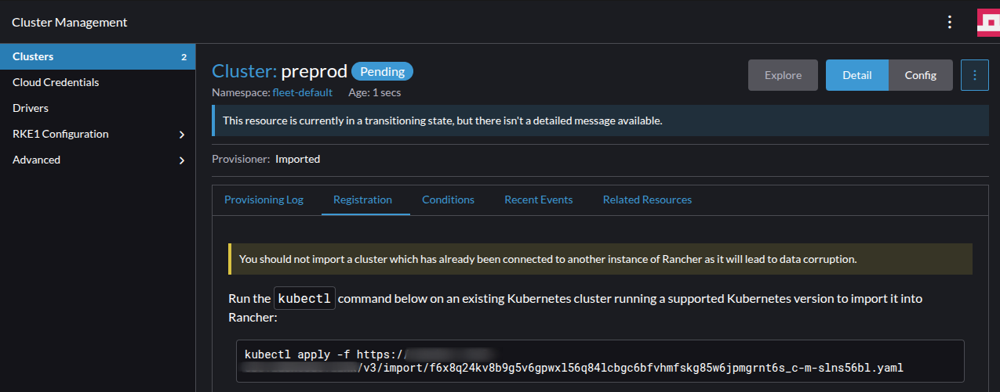
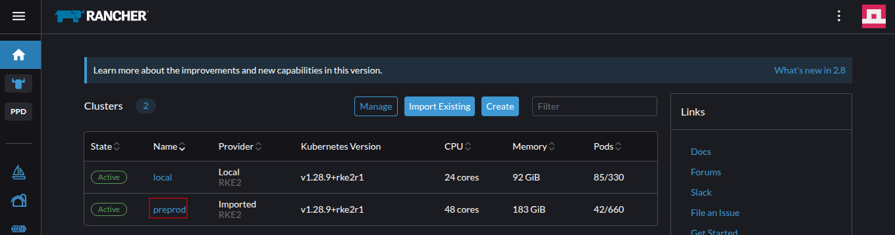
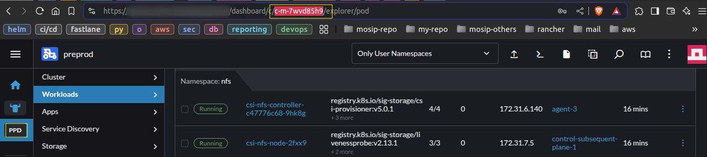
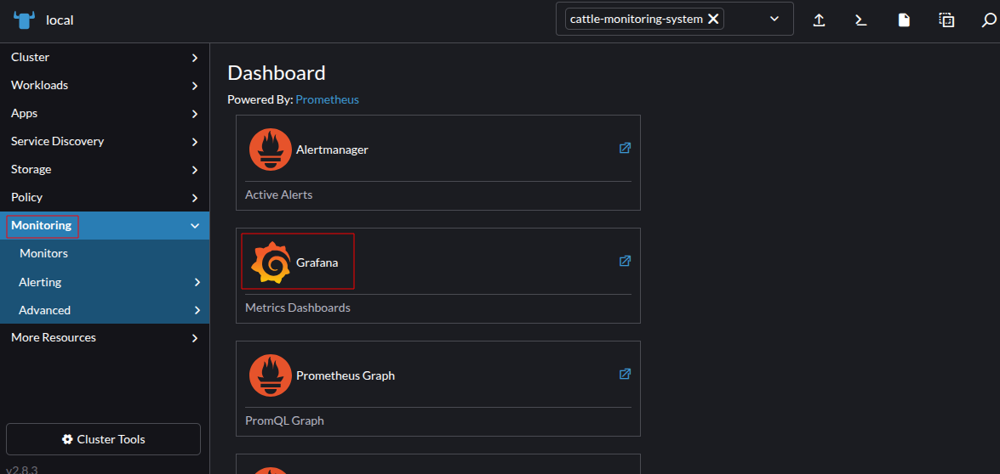

# Rancher Management Server Setup

## Prerequisites

- **Installation of Necessary Tools on Console Machine**
  * Install Git and Tmux:
    ```bash
    sudo apt update && sudo apt install git tmux -y
    ```
  * Install Ansible:
    ```bash
    sudo apt update && sudo apt install software-properties-common -y && sudo add-apt-repository   --yes --update ppa:ansible/ansible && sudo apt install ansible -y
    ```
  * Install Helm:
    ```bash
    wget https://get.helm.sh/helm-v3.16.2-linux-amd64.tar.gz && tar -zxvf helm-v3.16.2-linux-amd64.tar.gz && sudo mv linux-amd64/helm /bin/
    ```
  * Install istioctl:
    ```bash
    curl -L https://istio.io/downloadIstio | ISTIO_VERSION=1.22.0 TARGET_ARCH=x86_64 sh - 
    
    sudo mv istio-1.22.0/bin/istioctl /bin/
    ```
  * Verify Installed Tools:
    ```bash
    istioctl version
    ansible --version
    helm version
    ```

- **Operating System**:
  - Ensure that all the OS system is running with `Ubuntu 24.04.1 LTS` version:
    ```
    PRETTY_NAME="Ubuntu 24.04.1 LTS"
    NAME="Ubuntu"
    VERSION_ID="24.04"
    VERSION="24.04.1 LTS (Noble Numbat)"
    VERSION_CODENAME=noble
    ID=ubuntu
    ID_LIKE=debian
    HOME_URL="https://www.ubuntu.com/"
    SUPPORT_URL="https://help.ubuntu.com/"
    BUG_REPORT_URL="https://bugs.launchpad.net/ubuntu/"
    PRIVACY_POLICY_URL="https://www.ubuntu.com/legal/terms-and-policies/privacy-policy"
    UBUNTU_CODENAME=noble
    LOGO=ubuntu-logo
    ```
- **Infrastructure Requirements**:
  - Set up Virtual Machines (VMs) for the cluster.
  - Install `nfs-common` package on all the nodes of the Kubernetes cluster.
    ```bash
    sudo apt install nfs-common -y
    ```
  - Configure an NFS volume and mount it on the primary and subsequent control plane nodes at `/mnt/rancher-k8s-data/`.
    Ensure that the mount point for NFS volumes is added to `/etc/fstab` to ensure automatic mounting upon system boot.
    ```
    $ cat /etc/fstab
        ....
        ....
        172.16.119.11:/rancher-k8s-data /mnt/rancher-k8s-data   nfs     rw,sync,noac,vers=4     0 0
    ```
  - Set up a load balancer with a domain and IP for the Kubernetes cluster.
  - Expose the following ports on the load balancer.
   
    - `9345/tcp`
    - `443/tcp`
    - `6443/tcp` 
    - `61616/tcp`
    
    The load balancer route:
    
      ```
      eg: 
      -----
      Load balancer host                Load balancer               Kubernetes node ports
      ----------------------------------------------------------------------------------------------
      preprod.nsis.nira.go.ug               9345/tcp      ----->    <controlplane nodes> : 9345/tcp
      preprod.nsis.nira.go.ug               6443/tcp      ----->    <controlplane nodes> : 6443/tcp
      api-preprod.nsis.nira.go.ug           443/tcp       ----->    <kubernetes nodes>   : 30080/tcp
      api-internal-preprod.nsis.nira.go.ug  443/tcp       ----->    <kubernetes nodes>   : 31080/tcp
      acitvemq-preprod.nsis.nira.go.ug      61616/tcp     ----->    <kubernetes nodes>   : 31616/tcp
      ```
    Offload SSL on the load balancer.<br> 
    Ensure that the SSL certificates are not forwarded with the request from the load balancer to the Kubernetes node ports on `30080` & `31080`.

  - Obtain valid SSL certificates and domain names:
      - Domains:<br>
        eg:
    
         | Domain                                | Record Type | IP / CNAME                             |
         |---------------------------------------|-------------|----------------------------------------|
         | api-preprod.nsis.nira.go.ug           | A (IPv4)    | `X.X.X.X`                              |
         | api-internal-preprod.nsis.nira.go.ug  | A (IPv4)    | `Y.Y.Y.Y`                              |
         | prereg-preprod.nsis.nira.go.ug        | CNAME       | `api-preprod.nsis.nira.go.ug`          |
         | preprod.nsis.nira.go.ug               | CNAME       | `api-internal-preprod.nsis.nira.go.ug` |
         | activemq-preprod.nsis.nira.go.ug      | CNAME       | `api-internal-preprod.nsis.nira.go.ug` |
         | kibana-preprod.nsis.nira.go.ug        | CNAME       | `api-internal-preprod.nsis.nira.go.ug` |
         | admin-preprod.nsis.nira.go.ug         | CNAME       | `api-internal-preprod.nsis.nira.go.ug` |
         | regclient-preprod.nsis.nira.go.ug     | CNAME       | `api-internal-preprod.nsis.nira.go.ug` |
         | minio-preprod.nsis.nira.go.ug         | CNAME       | `api-internal-preprod.nsis.nira.go.ug` |
         | kafka-preprod.nsis.nira.go.ug         | CNAME       | `api-internal-preprod.nsis.nira.go.ug` |
         | iam-preprod.nsis.nira.go.ug           | CNAME       | `api-internal-preprod.nsis.nira.go.ug` |
         | pmp-preprod.nsis.nira.go.ug           | CNAME       | `api-internal-preprod.nsis.nira.go.ug` |

      - A wildcard SSL certificate for `*.nsis.nira.go.ug`.

  - Disable swap on all the Kubernetes nodes.
    ```bash
    sudo swapoff -a
    ```
    Remove swap file entry from `/etc/fstab` file and remove the swap file `/swap.img` from OS. 
    ```
    /swap.img     none    swap    sw      0       0
    ```
    Ensure to reboot the OS.
  
  - Expose the necessary ports for Kubernetes nodes to communicate to each other.
    - Control plane node / Subsequent control plane nodes:
      - Kubernetes API          : `9345/tcp`
      - RKE2 supervisor API     : `6443/tcp`
      - ETCD client port        : `2379/tcp`
      - ETCD peer port          : `2380/tcp`
      - ETCD metrics port       : `2381/tcp`
      - Kubelet metrics         : `10250/tcp`
      - Canal CNI with VXLAN    : `8472/udp`
      - Canal CNI health checks : `9099/tcp`
  
  - Start a tmux session on console machine to ensure session persistence.
    This allows you to resume your shell in case of a network disruption between your local system and the console machine.
    ```bash
    tmux new -s <session-name>
    ```
  
  - Configure ssh, from the console machine to all the Kubernetes nodes.
    * Generate SSH keys on your console machine:
      ```bash
      ssh-keygen -t rsa
      ```

    * Set up passwordless SSH access by copying your SSH key to remote machines using the following steps.
      - Install `sshpass` on console machine.
        ```bash
        sudo apt-get install sshpass -y 
        ```
      - Update the variables USERNAME, PASSWORD, and VM_LIST in the command below, then execute it from the console machine.<br>
        `USERNAME`: The username for SSH authentication.<br>
        `PASSWORD`: The corresponding password for the user.<br>
        `VM_LIST`: A space-separated list of IP addresses or hostnames of target machines, enclosed in double quotes.
        ```bash
        VM_LIST=("<node-1>" "<node-2>" "<node-3>" "<node-4>")
        USERNAME=<user-name>
        PASSWORD=<password>
        for VM in "${VM_LIST[@]}"; do
        echo "Server : $VM "
        sshpass -p "$PASSWORD" ssh-copy-id -o StrictHostKeyChecking=no $USERNAME@$VM
        done
        ```
        ```
        VM_LIST=("172.16.112.11" "172.16.112.12" "172.16.112.13")
        USERNAME=YYYYY
        PASSWORD=XXXXX
        ```

## Kubernetes Setup via Ansible Playbook

### Steps to Deploy the RKE2 Kubernetes Cluster:

1. Clone the repository:
   ```bash
   cd ~/
   git clone https://github.com/tf-nira/k8s-infra.git -b develop
   cd ~/k8s-infra/k8-cluster/on-prem/rke2/ansible
   ```

2. Create and update the inventory file:
    - Create inventory hosts file from sample file
      ```bash
      cp hosts.ini.sample hosts.ini
      ```
    - Define host details in `control_plane_primary`, `control_plane_subsequent`, and `agents` groups in `hosts.ini`:
      ```ini
      ansible_host=<internal_ip>
      ansible_user=<username>
      ansible_ssh_private_key_file=/home/<username>/.ssh/id_rsa
      ```
      Ensure `primary controlplane` and `controlplane subsequent` are odd number of nodes in total.
      ```
      eg: If 1 primary controlplane + 2 subsequent controlplane nodes = 3 (total)
      ```
    - Update variables in `hosts.ini` file:
       - `cluster_domain`: e.g., `rancher`
       - `rke2_token`: Unique token for nodes to join the kubernetes cluster.
       - `ETCD_BACKUP_DIR`: Path for etcd snapshots, e.g., `/mnt/rancher-k8s-data` (snapshots stored in `/mnt/rancher-k8s-data/etcd/snapshots`)
       - `AUDIT_BACKUP_DIR`: Path for audit logs, e.g., `/mnt/rancher-k8s-data` (logs stored in `/mnt/rancher-k8s-data/audit`)
       - `LB_DOMAIN`: e.g., `rancher.nsis.nira.go.ug`
       - `LB_IP`: e.g., `172.16.130.71`

3. Run the following command to initiate the setup of the RKE2 Kubernetes cluster:
   ```bash
   ansible-playbook -i hosts.ini main.yaml
   ```
   Upon successful execution, the Kubernetes cluster's kubeconfig file will be available on all control plane nodes at `/etc/rancher/rke2/rke2.yaml`

4. To manage the cluster from a console machine:
   - Copy the kubeconfig file from a control plane node to the console machine.
   - Set read only permission to the kubeconfig file.
     ```bash
     chmod 400 <kube-config-file>
     ```
   - Update the server URL within the copied kubeconfig file to point to the load balancers domain:
     ```
     server: https://<load-balancer-domain>:6443
     ```
     eg: replace `127.0.0.1` to `load-balancer-domain`
     ``` 
     apiVersion: v1
     clusters:
      - cluster:
        ....
        ....
        server: https://rancher.nsis.nira.go.ug:6443
        ....
       ```
5. Once the playbook executes successfully, copy the `kubectl` binary from one of the control plane nodes to the console machine.<br>
   Update username and control plane host in the below command to copy the kubectl executable file to console machine.
   ```bash
   scp <username>@<control-plane-host>:/var/lib/rancher/rke2/bin/kubectl ./kubectl
   ```
   Move the `kubectl` executable file to `/bin/` directory.
   ```bash
   sudo chmod +x ./kubectl && sudo mv ./kubectl /bin/
   ```
   Verify the kubectl version. i.e., `v1.28.9+rke2r1`
   ```bash
   kubectl version
   ```

6. Point kubectl to newly created cluster config file.
   ```bash
   export KUBECONFIG=/path/to/kubeconfig/file
   ```
   ```
   eg.
     export KUBECONFIG=/home/ubuntu/k8s-infra/k8-cluster/on-prem/rke2/ansible/playbook/kubeconfigs/rancher-control-plane-1.yaml`
   ```
   Access the kubernetes cluster via the below command:
   ```bash
   kubectl get nodes
   ```

**Note**: By default, the RKE2 server and agent services are disabled to prevent additional system load during OS boot.

## Registering a Cluster with the Rancher Management Server

To register an existing cluster with the Rancher management server, follow these steps:

* *Log in to the Rancher Dashboard*
    - Open the Rancher dashboard at [`https://rancher.nsis.nira.go.ug`](https://rancher.nsis.nira.go.ug).
    - Sign in with administrator credentials (`admin`).

* Navigate to the `Home page` or `Cluster management` section and select **"Import Existing"**.
  

* Select **"Generic"** as the cluster type.
  
* Enter a unique name in the **"Cluster Name"** field and click on **"Create"** to proceed.
  

* Rancher will generate a `kubectl` command to register the cluster and run the provided command on the MOSIP Kubernetes cluster.
  ```
  eg:   
    kubectl apply -f https://rancher.nsis.nira.go.ug/v3/import/pdmkx6b4xxtpcd699gzwdtt5bckwf4ctdgr7xkmmtwg8dfjk4hmbpk_c-m-db8kcj4r.yaml
  ```  
  

* Wait for a few moments while Rancher verifies the cluster.<br>
  Once verification is complete, the cluster will be successfully added to the Rancher management server.
  ```
  $ kubectl get po -n cattle-system
    NAME                                    READY   STATUS      RESTARTS   AGE
    cattle-cluster-agent-7d74595845-lcs2k   1/1     Running     0          2m41s
    cattle-cluster-agent-7d74595845-v9txf   1/1     Running     0          104s
    helm-operation-jwqz8                    0/2     Completed   0          81s
    rancher-webhook-bcc8984b6-f7488         1/1     Running     0          66s
  ```
  
Your cluster is now registered and can be managed via Rancher. 🚀

## Install nfs-csi
* Navigate to nfs directory.
  ```bash
  cd ~/k8s-infra/storage-class/nfs
  ```
* Run `./install-nfs-csi.sh` to deploy NFS client provisioner.
  Ensure to provide valid NFS server and NFS server path.
  ```bash
  ./install-nfs-csi.sh
    .....
    Please provide NFS SERVER: <NFS-SERVER>
    Please provide NFS Path: <NFS-SERVER-PATH>
  ```

## Monitoring deployment
* Navigate to the Monitoring directory:
  ```bash
  cd ~/k8s-infra/monitoring/
  ```
* Get the `cluster-id` from Rancher management server as shown in below image.
  
* Run `install.sh` to deploy monitoring application. Provide the `cluster-id` as user input variable as shown in the below image.
  ```bash
  ./install.sh
  ....
  ....
  Please enter the env cluster-id: local
  ```
* To access Grafana dashboard, navigate to the cluster on Rancher Dashboard ---> `All namespace` ---> `Monitoring` ---> `Grafana Dashboards`.
  
* Use the below command to fetch the `admin` user password for grafana dashboard.
  ```bash
  kubectl -n cattle-monitoring-system get secret rancher-monitoring-grafana -o json | jq -r '.data."admin-password" | @base64d'
  ```

## Global configmap
* Navigate to `k8s-infra` directory.
  ```bash
  cd ~/k8s-infra/
  ```
* Create `global-configmap.yaml` file from sample file `global-configmap.sample.`
  ```bash
  cp global-configmap.sample global-configmap.yaml
  ```
* Update the domain name in `global-configmap.yaml` file.
* Run the below command to create global configmap on default namespace.
  ```bash
  kubectl -n default apply -f global-configmap.yaml
  ```

## Setup Istio Ingress as Istio NodePort
* Navigate to `Istio-mesh/nodeport` directory.
  ```bash
  cd ~/k8s-infra/ingress/istio-mesh/nodeport/
  ```
* Run `./install.sh` to deploy Istio.
  ```bash
  ./install.sh
  ```

## Logging Deployment Guide

#### Deployment

1. Navigate to the Logging Directory.<br>
   Change to the logging directory before proceeding with the deployment:
   ```bash
   cd ~/k8s-infra/logging/
   ```

2. Deploy the Logging Operator.<br>
   Run the `install.sh` script to install the logging operator and associated applications:
   ```bash
   ./install.sh
   ```

3. Configure Elasticsearch Index Lifecycle Policy.<br>
   Modify the `./elasticsearch-ilm-script.sh` file as per your requirements.<br>
   Then, execute the script to apply the **Index Lifecycle Policy** and **Index Template** to Elasticsearch:
   ```bash
   ./elasticsearch-ilm-script.sh
   ```

#### **Configure Rancher Fluentd**
To collect logs, create **ClusterOutputs** as follows:

- Create an Elasticsearch ClusterOutput:
  ```bash
  kubectl apply -f clusteroutput-elasticsearch.yaml
  ```

- Create a ClusterFlow:
  ```bash
  kubectl apply -f clusterflow-elasticsearch.yaml
  ```

#### Dashboards Configuration
* Load Dashboards into Kibana.<br>
  Run the following command to import all dashboards from the `./dashboards` directory into Kibana:
  ```bash
  ./load_kibana_dashboards.sh ./dashboards <cluster-kube-config-file>
  ```

## Httpbin
* Navigate to `httpbin` directory
  ```
  cd ~/k8s-infra/utils/httpbin/
  ```
* Run `./install.sh` to deploy `httpbin` application.
* Use curl command to access `httpbin` service via both public and private url. This is to ensure that services are accessible via both public and private urls.
  ```
  $ curl https://api-internal-preprod.nsis.nira.go.ug/httpbin/get?show_env=true
    {
    "args": {
    "show_env": "true"
    },
    "headers": {
      "Accept": "*/*",
      "Host": "api-internal-preprod.nsis.nira.go.ug",
      "User-Agent": "curl/8.5.0",
      "X-Envoy-Attempt-Count": "1",
      "X-Envoy-External-Address": "10.42.3.0",
      "X-Envoy-Original-Path": "/httpbin/get?show_env=true",
      "X-Forwarded-Client-Cert": "By=spiffe://cluster.local/ns/httpbin/sa/httpbin;Hash=2274b023d49f93f6a726e1f055bbd9e08a1721db15dcb9f93d8493999a9e03d3;Subject=\"\";URI=spiffe://cluster.local/ns/istio-system/sa/istio-ingressgateway-internal-service-account",
      "X-Forwarded-For": "172.31.1.176,10.42.3.0",
      "X-Forwarded-Proto": "https",
      "X-Real-Ip": "172.31.1.176",
      "X-Request-Id": "634b65e6-5330-462a-8edd-545cde074586"
    },
    "origin": "172.31.1.176,10.42.3.0",
    "url": "https://api-internal-preprod.nsis.nira.go.ug/get?show_env=true"
    }

  ```
* ```
    $ curl https://api-preprod.nsis.nira.go.ug/httpbin/get?show_env=true
    {
    "args": {
    "show_env": "true"
    },
    "headers": {
      "Accept": "*/*",
      "Host": "api-preprod.nsis.nira.go.ug",
      "User-Agent": "curl/7.81.0",
      "X-Envoy-Attempt-Count": "1",
      "X-Envoy-External-Address": "10.42.3.0",
      "X-Envoy-Original-Path": "/httpbin/get?show_env=true",
      "X-Forwarded-Client-Cert": "By=spiffe://cluster.local/ns/httpbin/sa/httpbin;Hash=8223965a2c5a88fad79a6e36e2590800eae149d872cd8649b96aa4978bba4ecd;Subject=\"\";URI=spiffe://cluster.local/ns/istio-system/sa/istio-ingressgateway-service-account",
      "X-Forwarded-For": "103.13.43.244,10.42.3.0",
      "X-Forwarded-Proto": "https",
      "X-Real-Ip": "103.13.43.244",
      "X-Request-Id": "dab07183-4eed-45c5-a788-197fc9741d3f"
    },
    "origin": "103.13.43.244,10.42.3.0",
    "url": "https://api-preprod.nsis.nira.go.ug/get?show_env=true"
    }

  ```

## External Modules

#### Clone `mosip-infra` repository
* Clone the repository.
  ```
  cd ~/
  ```
  ```
  git clone https://github.com/tf-nira/mosip-infra.git -b NIRA-INFRA
  ```

#### Postgres Server setup (Optional)
* Skip this step if external postgres server is available.
* Navigate to postgres directory.
  ```
  cd ~/mosip-infra/deployment/v3/external/postgres/
  ```
* Install `Postgres` server on kubernetes (If you would like to set up postgres server directly on cluster.) (optional)
  ```bash
  ./install.sh
  ```
#### Database initialization
* Ensure `postgres` username and `postgres` database is created with the superuser permission.
* Navigate to postgres directory.
  ```
  cd ~/mosip-infra/deployment/v3/external/postgres/
  ```
* Provide the password for postgres user in the below variable `POSTGRES_PASSWORD`. 
  ```bash
  export POSTGRES_PASSWORD=""
  ```
  Execute the command on cluster / console pointing to MOSIP cluster to create kubernetes secret.
  ```bash
  kubectl -n postgres create secret generic mosip-user-db-credentials  --from-literal="mosip-user-password=$POSTGRES_PASSWORD"  --dry-run=client  -o yaml | kubectl apply -f -
  ```
* Update `<database-host>`, `<database-port>`, `dbuserPassword` in `init_values.yaml`.<br>
  `dbuserPassword` will be the common password for all the DB's. Ensure to provide strong password

* Use the below syntax to provide repo url for a private repo in `init_values.yaml` file which contains the DB scripts.
  ```
  https://<token>@github.com/<account>/<repository>.git
  ```

#### Keycloak
* Navigate to keycloak directory.
  ```
  cd ~/mosip-infra/deployment/v3/external/iam/
  ```
* Create keycloak DB via the below command.

## Configuring SMTP and Login Settings in Keycloak

#### Login Settings
* Navigate to **MOSIP Realm** → **Realm Settings** → **Login** → Enable the options provided in the below image:<br>
  
* Navigate to **Master Realm** → **Users** → **Search for admin user**.
  
* Enable `Email Verified` option for admin user.<br>
  

#### Configuring SMTP
To enable SMTP and login configurations in Keycloak, follow these steps:

* Before configuring SMTP, ensure that the Keycloak admin user has an email address, first name, and last name specified. Refer to the [integration guide](#integrate-keycloak-with-rancher-ui) for more details.
* Navigate to **Master Realm** → **Realm Settings** → **Email**.
* Enter the required SMTP details as shown in the image below:  
  
* Click **Save** to apply the settings.
* Click **Test Connection** to verify that Keycloak can successfully send emails.<br>
  This configuration ensures that Keycloak can send email notifications, such as password resets and account updates, to users.

