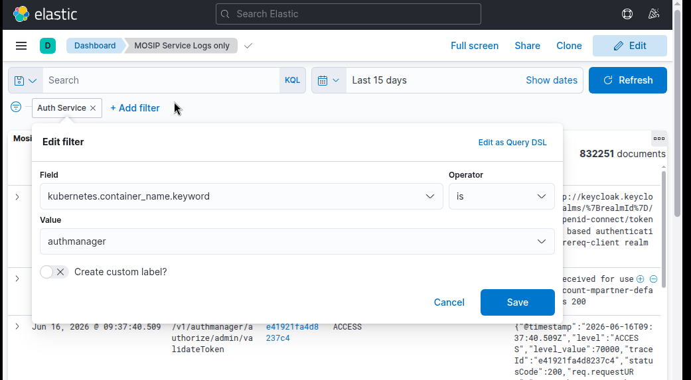

# Logging Deployment Guide

### Elasticsearch
Elasticsearch is a distributed, RESTful search and analytics engine built on top of Apache Lucene. It stores, indexes, and searches large volumes of structured and unstructured data in near real-time.
Common use cases:
* Log analytics
* Application monitoring
* Full-text search
* Security analytics
* Business intelligence
* Metrics and observability

### Kibana
Kibana connects to Elasticsearch. Make sure you have a domain like `kibana.sandbox.xyz.net` pointing to your internal load balancer included in [global ConfigMap](../../global-configmap.yaml.sample).

### Install Elasticsearch, Kibana, Istio addons and logging operator.
1. Navigate to the Logging Directory.<br>
   Change to the logging directory before proceeding with the deployment:
   ```bash
   cd ~/k8s-infra/logging/
   ```

2. Deploy the Logging Operator.<br>
   Run the `install.sh` script to install the logging operator and associated applications:
   ```bash
   ./install.sh
   ```

3. Configure Elasticsearch Index Lifecycle Policy.<br>
    * Modify the MOSIP logs index log lifecycle policy in `./elasticsearch-ilm-script.sh` file as per your requirements.
      >**Note:**
      >>**For Sandbox:** 
      >>* Default ILM policy is set to 3d (3 days): `3_days_delete_policy` in `./elasticsearch-ilm-script.sh`.
      
      >>**For Production:**
      >>* Ensure ILM policy is set to minimum 90d (90 days): `90_days_delete_policy` in `./elasticsearch-ilm-script.sh`.
      >>* ```
      >>  ....
      >>  "min_age": "3d", 
      >>  ....
      >>  3_days_delete_policy ## replace this with `90_days_delete_policy`
      >>  ```

   Then, execute the script to apply the **Index Lifecycle Policy** and **Index Template** to Elasticsearch:
   ```bash
   ./elasticsearch-ilm-script.sh
   ```

### **Configure Rancher Fluentd**
To collect logs from MOSIP services create _ClusterOutputs_ as belows:

* Use the following command to create `elasticsearch` _ClusterOutput_.
  ```bash
  kubectl apply -f clusteroutput-elasticsearch.yaml
  ```
* Use the following command to create `mosip-logs` _ClusterFlow_.
  ```bash
  kubectl apply -f clusterflow-elasticsearch.yaml
  ```

### Dashboards Configuration
* Load Dashboards into Kibana.<br>
  Run the following command to import all dashboards from the [`./dashboards`](../../logging/dashboards) directory into Kibana:
  ```bash
  ./load_kibana_dashboards.sh ./dashboards <cluster-kube-config-file>
  ```
* To view Dashboards in `Kibana` <br>
  Goto _Kibana_ --> _Menu_ (on top left) --> _Dashboard_ --> Select the dashboard.
  

### Delete Dashboards in Kibana
* Run the following to delete all dashboards in the [`./dashboards`](../../logging/dashboards) folder from Kibana.
```sh
./delete_kibana_dashboards.sh ./dashboards <cluster-kube-config-file>
```

## Elasticsearch indices
Day wise indices with the name `logstash*` are created once the above dashboards are imported. The `logstash_format: true` setting above enables the same.

To see day wise logs indices created in Elasticsearch login to one of the Master pods of Elasticsearch via Rancher and issue following command:
```
curl http://localhost:9200/_cat/indices | grep logstash
```
**Cleanup**: You may archive or delete older logs.

## Filters
Note the filters applied in [clusterflow-elasticsearch.yaml](../../logging/clusterflow-elasticsearch.yaml). You may update the same for your installation if required. 
