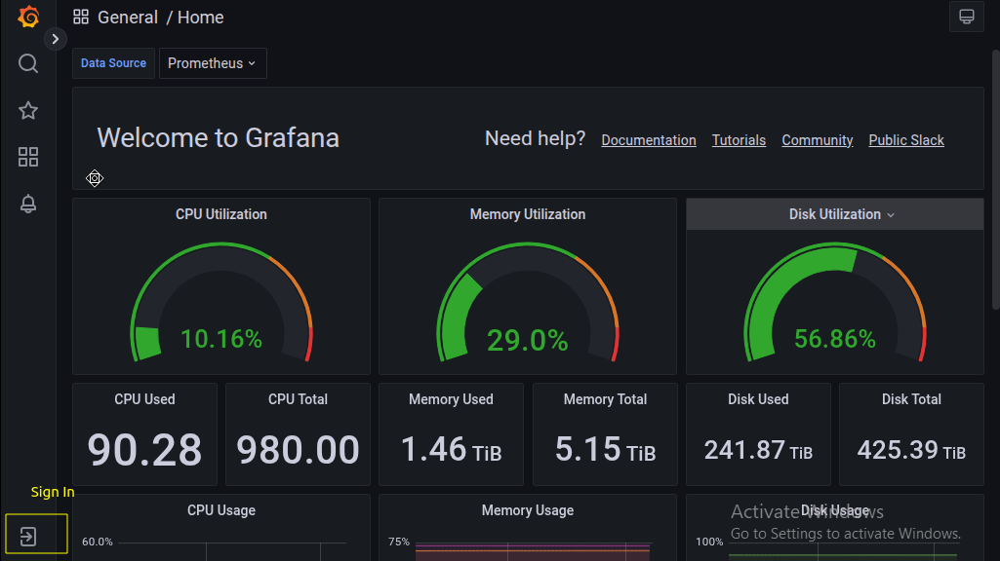
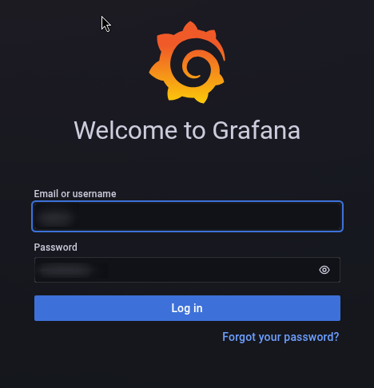
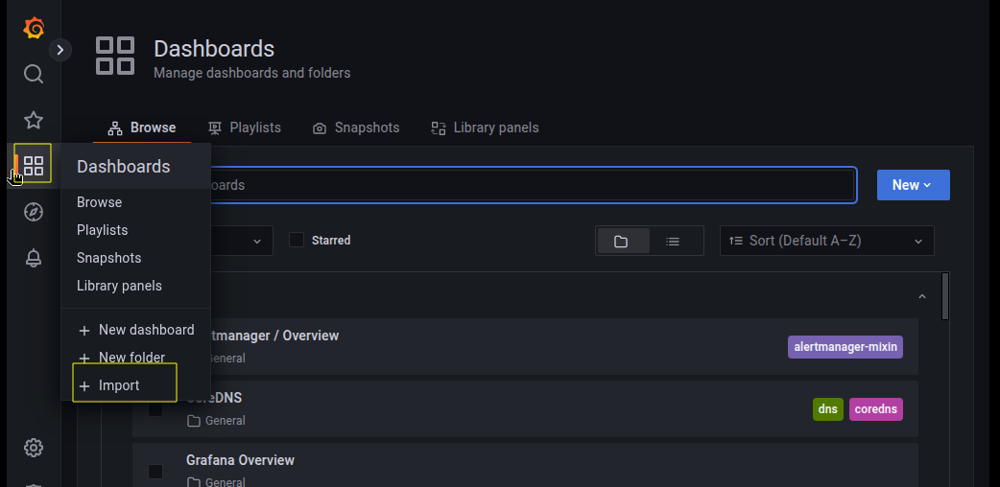
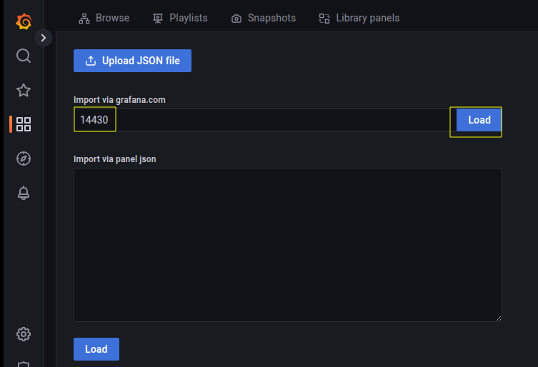
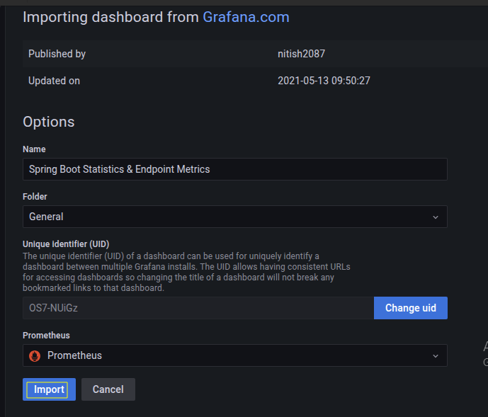
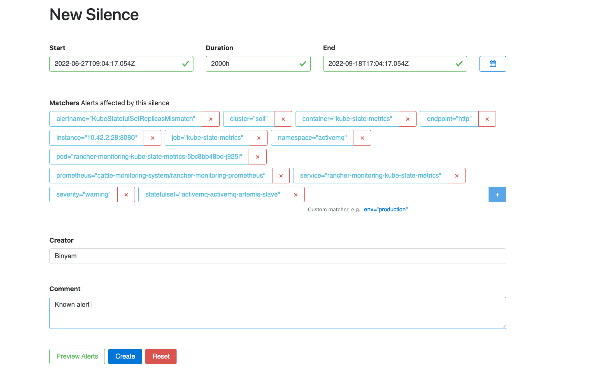
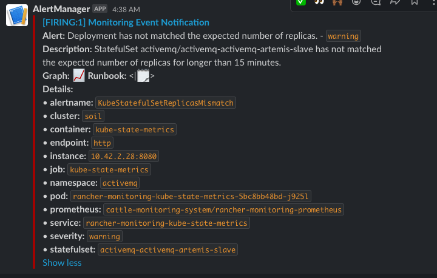

## Monitoring deployment
Prometheus and Grafana tools are used to monitor the cluster.

* Navigate to the `monitoring` directory:
  ```bash
  cd ~/k8s-infra/monitoring/
  ```
* Get the `cluster-id` from Rancher management server as shown in below image.
  
* Update the replicas in `values.yaml` file. <br>
  >**Note:**
  >>**For Sandbox:**
  >>* Ensure to set replicas value to 1.
  >>* For Data Retention `15d` (15 days).
  >>* Resource Limit: CPU : 1 (vcpu), 3Gi (GiB RAM)
  >>**For Production:**
  >>* Ensure to set replicas value to 5.
  >>* For Data Retention `90d` (90 days).
  >>* Resource Limit: CPU : 3 (vcpu), 20Gi (GiB RAM)
  ```
  alertmanager:
    alertmanagerSpec:
      replicas: 1
  prometheus:
    prometheusSpec:
      replicas: 1
      resources:
        limits:
          cpu: 1000m
          memory: 3000Mi
        requests:
          cpu: 750m
          memory: 750Mi
      retention: 15d
      retentionSize: 50GiB
  thanosRuler:
    thanosRulerSpec:
      replicas: 1
  ```
* Run `install.sh` to deploy monitoring application. Provide the `cluster-id` as user input variable as shown in the below image.
  ```bash
  ./install.sh
  ....
  ....
  Please enter the env cluster-id: c-m-7wd85h5
  ```
* To access Grafana dashboard, navigate to the cluster on Rancher Dashboard ---> `All namespace` ---> `Monitoring` ---> `Grafana Dashboards`.
  
* Use the below command to fetch the `admin` user password for grafana dashboard.
  ```bash
  kubectl -n cattle-monitoring-system get secret rancher-monitoring-grafana -o json | jq -r '.data."admin-password" | @base64d'
  ```
* Click on `Sign-In` icon as shown in below image ---> Provide username and password
  
  

* To see JVM stats you may import chart number `14430` in Grafana dashboard.
  
  
  
* Important default dashboards:

  |Grafana dashboard|Description|
  |---|---|
  |Rancher/Cluster (Nodes)|Consolidated view of all nodes|
  |Rancher/Node|View of each node|
  |Kubernetes/Pesistent Volumes|Storage consumption per PV|
  |Kubernetes/Compute Resources/Workload|Resources per deployment/statefulset|
  |Kubernetes/Compute Resources/Cluster|Resources namespace wise|


#### JVM stats
MOSIP pods make JVM stats available for Prometheus to scrape the pods. The typical endpoint looks like
`<base url>/actuator/prometheus`.
The scrapping is enabled via module Helm chart (see `metrics` section of `values.yaml`).

A sample of metrics that is pulled by Prometheus is given in [`pod-jvm-scraped-metrics-sample.txt`](../../monitoring/pod-jvm-scraped-metrics-sample.txt)

#### Inodes
To see free inodes on a particular node, login to the node an run
```
df -ih
```

## Cluster Alerting
Alerting is part of cluster monitoring, where alert notifications are sent to the configured Slack channel.

### Prerequisite
Prometheus, Grafana, and alert manager tools are needed to set up alert notifications. [Install monitoring](../../monitoring/README.md).

### Slack alerts notification

- Creating slack incoming webhook [here](https://api.slack.com/messaging/webhooks),
  * Create a slack application for your environment from the above url.
  * After creating the app select `Incoming webhooks` from `Features` section.
  * Then Activate Incoming webhooks.
  * Then select `Add New Webhook To Workspace` and choose a slack channel where the alerts need to be notified.
  * Then Incoming webhook url will be created.
- Goto `alerting` directory
  ```
  cd ~/k8s-infra/alerting
  ```
- update ``slack_api_url`` and ``channel`` in ``alertmanager.yaml``
- run ``./install.sh `` to patch alertmanager.

## Creating custom alerts

The monitoring package provided by rancher has various default alerting rules, most of the time the default rules are enough. Sample custom alerts are provided under ``custom-alerts``. Modify the same and apply using ``kubectl``

## Silence/Mute alerts

- Go to alertmanager under monitoring tab in rancher ui
- Click on the alert -> silence, add appropriate silence duration, creator, and comment



## Add cluster name to the alert

When having multiple clusters, you can add a cluster name to be presented as part of alert information. Here our cluster name is soil.



- Add cluster name in,  ``patch-cluster-name.yaml``
- Run  ``install.sh``

