# Rancher Management Server Setup

## Prerequisites

- **Installation of Necessary Tools on Console Machine**
  * Install Git and Tmux:
    ```bash
    sudo apt update && sudo apt install git tmux -y
    ```
  * Install Ansible:
    ```bash
    sudo apt update && sudo apt install software-properties-common -y && sudo add-apt-repository   --yes --update ppa:ansible/ansible && sudo apt install ansible -y
    ```
  * Install Helm:
    ```bash
    wget https://get.helm.sh/helm-v3.16.2-linux-amd64.tar.gz && tar -zxvf helm-v3.16.2-linux-amd64.tar.gz && sudo mv linux-amd64/helm /bin/
    ```
  * Verify Installed Tools:
    ```bash
    ansible --version
    helm version
    ```

- **Operating System**:
  - Ensure that all the OS system is running with `Ubuntu 24.04.1 LTS` version:
    ```
    PRETTY_NAME="Ubuntu 24.04.1 LTS"
    NAME="Ubuntu"
    VERSION_ID="24.04"
    VERSION="24.04.1 LTS (Noble Numbat)"
    VERSION_CODENAME=noble
    ID=ubuntu
    ID_LIKE=debian
    HOME_URL="https://www.ubuntu.com/"
    SUPPORT_URL="https://help.ubuntu.com/"
    BUG_REPORT_URL="https://bugs.launchpad.net/ubuntu/"
    PRIVACY_POLICY_URL="https://www.ubuntu.com/legal/terms-and-policies/privacy-policy"
    UBUNTU_CODENAME=noble
    LOGO=ubuntu-logo
    ```
- **Infrastructure Requirements**:
  - Set up Virtual Machines (VMs) for the cluster.
  - Install `nfs-common` package on all the nodes of the Kubernetes cluster.
    ```bash
    sudo apt install nfs-common -y
    ```
  - Configure an NFS volume and mount it on the primary and subsequent control plane nodes at `/mnt/rancher-k8s-data/`.
    Ensure that the mount point for NFS volumes is added to `/etc/fstab` to ensure automatic mounting upon system boot.
    ```
    $ cat /etc/fstab
        ....
        ....
        172.16.119.11:/rancher-k8s-data /mnt/rancher-k8s-data   nfs     rw,sync,noac,vers=4     0 0
    ```
  - Set up a load balancer with a domain and IP for the Kubernetes cluster.
  - Expose the following ports on the load balancer.
   
    - `9345/tcp`
    - `443/tcp`
    - `6443/tcp` 
    
    The load balancer route:
    
      ```
      Load balancer host                Load balancer               Kubernetes node ports
      ----------------------------------------------------------------------------------------------
      rancher.nsis.nira.go.ug            9345/tcp        ----->    <controlplane nodes> : 9345/tcp
      rancher.nsis.nira.go.ug            6443/tcp        ----->    <controlplane nodes> : 6443/tcp
      rancher.nsis.nira.go.ug            443/tcp         ----->    <kubernetes nodes>   : 30443/tcp
      keycloak.nsis.nira.go.ug           443/tcp         ----->    <kubernetes nodes>   : 30443/tcp
      rancher-kibana.nsis.nira.go.ug     443/tcp         ----->    <kubernetes nodes>   : 30080/tcp
      ```
    For `rancher.nsis.nira.go.ug` and `keycloak.nsis.nira.go.ug`, do not offload SSL on the load balancer.<br> 
    Ensure that the SSL certificates are forwarded with the request from the load balancer to the Kubernetes node ports on `30443`.
  

  - Obtain valid SSL certificates and domain names:
      - Domains: `rancher.nsis.nira.go.ug`, `keycloak.nsis.nira.go.ug`
      - A wildcard SSL certificate for `*.nsis.nira.go.ug`.

  - Disable swap on all the Kubernetes nodes.
    ```bash
    sudo swapoff -a
    ```
    Remove swap file entry from `/etc/fstab` file and remove the swap file `/swap.img` from OS. 
    ```
    /swap.img     none    swap    sw      0       0
    ```
    Ensure to reboot the OS.
  
  - Expose the necessary ports for Kubernetes nodes to communicate to each other.
    - Control plane node / Subsequent control plane nodes:
      - Kubernetes API          : `9345/tcp`
      - RKE2 supervisor API     : `6443/tcp`
      - ETCD client port        : `2379/tcp`
      - ETCD peer port          : `2380/tcp`
      - ETCD metrics port       : `2381/tcp`
      - Kubelet metrics         : `10250/tcp`
      - Canal CNI with VXLAN    : `8472/udp`
      - Canal CNI health checks : `9099/tcp`
  
  - Start a tmux session on console machine to ensure session persistence.
    This allows you to resume your shell in case of a network disruption between your local system and the console machine.
    ```bash
    tmux new -s <session-name>
    ```
  
  - Configure ssh, from the console machine to all the Kubernetes nodes.
    * Generate SSH keys on your console machine:
      ```bash
      ssh-keygen -t rsa
      ```
    
    <br><br>

    * Set up passwordless SSH access by copying your SSH key to remote machines using the following steps.
      - Install `sshpass` on console machine.
        ```bash
        sudo apt-get install sshpass -y 
        ```
      - Update the variables USERNAME, PASSWORD, and VM_LIST in the command below, then execute it from the console machine.<br>
        `USERNAME`: The username for SSH authentication.<br>
        `PASSWORD`: The corresponding password for the user.<br>
        `VM_LIST`: A space-separated list of IP addresses or hostnames of target machines, enclosed in double quotes.
        ```bash
        VM_LIST=("<node-1>" "<node-2>" "<node-3>" "<node-4>")
        USERNAME=<user-name>
        PASSWORD=<password>
        for VM in "${VM_LIST[@]}"; do
        echo "Server : $VM "
        sshpass -p "$PASSWORD" ssh-copy-id -o StrictHostKeyChecking=no $USERNAME@$VM
        done
        ```
        ```
        VM_LIST=("172.16.112.11" "172.16.112.12" "172.16.112.13")
        USERNAME=YYYYY
        PASSWORD=XXXXX
        ```

## Kubernetes Setup via Ansible Playbook

### Steps to Deploy the RKE2 Kubernetes Cluster:

1. Clone the repository:
   ```bash
   cd ~/
   git clone https://github.com/tf-nira/k8s-infra.git -b develop
   cd ~/k8s-infra/k8-cluster/on-prem/rke2/ansible
   ```

2. Create and update the inventory file:
    - Create inventory hosts file from sample file
      ```bash
      cp hosts.ini.sample hosts.ini
      ```
    - Define host details in `control_plane_primary` and `control_plane_subsequent` groups in `hosts.ini`:
      ```ini
      ansible_host=<internal_ip>
      ansible_user=<username>
      ansible_ssh_private_key_file=/home/<username>/.ssh/id_rsa
      ```
    - Comment out the `agents` group in `hosts.ini` file.
    - Update variables in `hosts.ini` file:
       - `cluster_domain`: e.g., `rancher`
       - `rke2_token`: Unique token for nodes to join the kubernetes cluster.
       - `ETCD_BACKUP_DIR`: Path for etcd snapshots, e.g., `/mnt/rancher-k8s-data` (snapshots stored in `/mnt/rancher-k8s-data/etcd/snapshots`)
       - `AUDIT_BACKUP_DIR`: Path for audit logs, e.g., `/mnt/rancher-k8s-data` (logs stored in `/mnt/rancher-k8s-data/audit`)
       - `LB_DOMAIN`: e.g., `rancher.nsis.nira.go.ug`
       - `LB_IP`: e.g., `172.16.130.71`

<br>

3. Run the following command to initiate the setup of the RKE2 Kubernetes cluster:
   ```bash
   ansible-playbook -i hosts.ini main.yaml
   ```
   Upon successful execution, the Kubernetes cluster's kubeconfig file will be available on all control plane nodes at `/etc/rancher/rke2/rke2.yaml`

4. To manage the cluster from a console machine:
   - Copy the kubeconfig file from a control plane node to the console machine.
   - Set read only permission to the kubeconfig file.
     ```bash
     chmod 400 <kube-config-file>
     ```
   - Update the server URL within the copied kubeconfig file to point to the load balancers domain:
     ```
     server: https://<load-balancer-domain>:6443
     ```
     eg: replace `127.0.0.1` to `load-balancer-domain`
     ``` 
     apiVersion: v1
     clusters:
      - cluster:
        ....
        ....
        server: https://rancher.nsis.nira.go.ug:6443
        ....
       ```
5. Once the playbook executes successfully, copy the `kubectl` binary from one of the control plane nodes to the console machine.<br>
   Update username and control plane host in the below command to copy the kubectl executable file to console machine.
   ```bash
   scp <username>@<control-plane-host>:/var/lib/rancher/rke2/bin/kubectl ./kubectl
   ```
   Move the `kubectl` executable file to `/bin/` directory.
   ```bash
   sudo chmod +x ./kubectl && sudo mv ./kubectl /bin/
   ```
   Verify the kubectl version. i.e., `v1.28.9+rke2r1`
   ```bash
   kubectl version
   ```

6. Point kubectl to newly created cluster config file.
   ```bash
   export KUBECONFIG=/path/to/kubeconfig/file
   ```
   eg. 
   ```
   export KUBECONFIG=/home/ubuntu/k8s-infra/k8-cluster/on-prem/rke2/ansible/playbook/kubeconfigs/rancher-control-plane-1.yaml`
   ```
   Access the kubernetes cluster via the below command:
   ```bash
   kubectl get nodes
   ```

**Note**: By default, the RKE2 server and agent services are disabled to prevent additional system load during OS boot.


## Setup Ingress as NodePort
* Navigate to ingress-nginx directory
  ```bash
  cd ~/k8s-infra/ingress/ingress-nginx
  ```
* Add helm repo and update the same:
  ```bash
  helm repo add ingress-nginx https://kubernetes.github.io/ingress-nginx
  helm repo update
  ```
* Helm install ingress-nginx
  ```bash
  helm install ingress-nginx ingress-nginx/ingress-nginx --namespace ingress-nginx --version 4.0.18      --create-namespace  -f ingress-nginx-np.values.yaml
  ```
  ```bash
  kubectl get all -n ingress-nginx
  ```


## Install nfs-csi
* Navigate to nfs directory.
  ```bash
  cd ~/k8s-infra/storage-class/nfs
  ```
* Run `./install-nfs-csi.sh` to deploy NFS client provisioner.
  Ensure to provide valid NFS server and NFS server path.
  ```bash
  ./install-nfs-csi.sh
    .....
    Please provide NFS SERVER: <NFS-SERVER>
    Please provide NFS Path: <NFS-SERVER-PATH>
  ```

## Rancher deployment
* Navigate to rancher-ui directory.
  ```bash
  cd ~/k8s-infra/apps/rancher-ui/
  ```
* Install rancher using Helm, update `hostname` in `rancher-values.yaml` and run the following command to install.
  ```bash
  helm repo add rancher-latest https://releases.rancher.com/server-charts/latest
  helm repo update
  helm install rancher rancher-latest/rancher \
    --namespace cattle-system \
    --create-namespace \
    -f rancher-values.yaml \
    --version=2.8.3
  ```

### Login
* Open Rancher page `https://rancher.nsis.nira.go.ug`.
* Get Bootstrap password using
  ```bash
  kubectl get secret --namespace cattle-system bootstrap-secret -o go-template='{{ .data.bootstrapPassword|base64decode}}{{ "\n" }}'
  ```
* Assign a password.  IMPORTANT: makes sure this password is securely saved and retrievable by Admin.
* Remove port `30443` from the `server-url` section in the Rancher dashboard, if present.<br>
  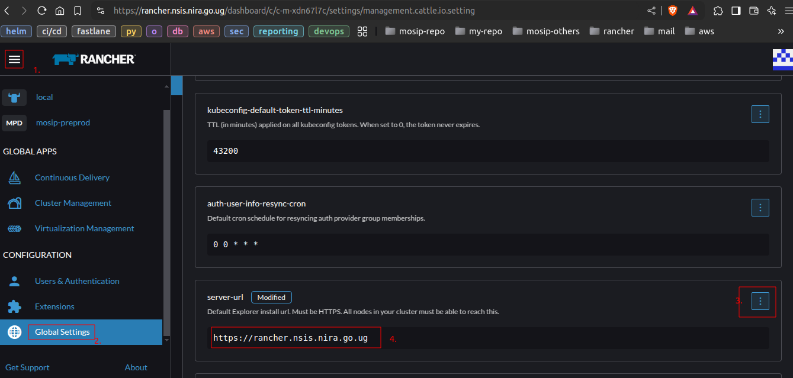

## Keycloak deployment
* Navigate to the Keycloak application directory:
  ```bash
  cd ~/k8s-infra/apps/keycloak/
  ```
* Ensure that the `tls.crt` and `tls.key` files, which contain the public and private certificates for `*.nsis.nira.go.ug`, are available.
  Then, create the secret in the Keycloak namespace via the below commands
  ```bash
  kubectl create ns keycloak
  ```
  ```bash
  kubectl create secret tls nira-tls-secret --cert=tls.crt  --key=tls.key -n keycloak
  ```
  `tls.crt` : contain the full chain certificate <br>
  `tls.key` : contain the private for the certificate
* Update tls hosts and secret name containing the SSL certificates `nira-tls-secret` in `values.yaml` file.
  ```
    ingress:
      enabled: true
      ...
      ...
      extraTls:
      - hosts:
        - keycloak.nsis.nira.go.ug
        secretName: nira-tls-secret
  ```
* Pass the path to your kubeconfig file and the Keycloak hostname as parameters.
  ```bash
  ./install.sh <KUBECONFIG-FILE> <keycloak.host.name>
  ```
  eg. `./install.sh </PATH/TO/KUBECONFIG/FILE> keycloak.nsis.nira.go.ug`

<br><br><br><br><br><br>

## Integrate Keycloak with Rancher UI
* Log in as the `admin` user in Keycloak and ensure that the `email ID`, `first name`, and `last name` fields are populated for the admin account.
  This is essential for Rancher authentication.
  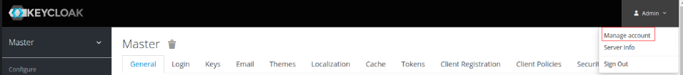
  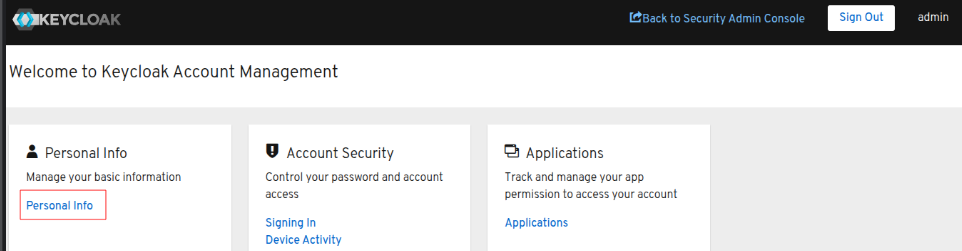
  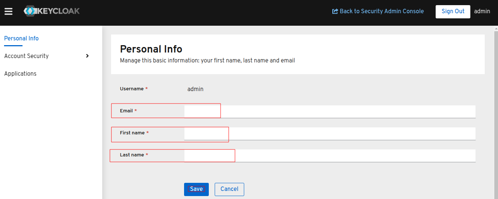

* Create client for via `keycloak_client.json`.
  * Navigate to `Keycloak` ---> `master realm` ---> `Clients` ----> `Create`.
    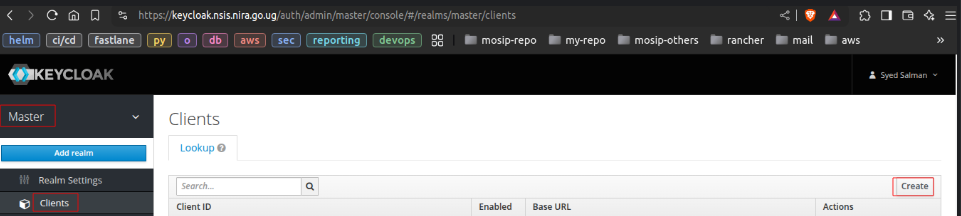
  * Click on `Select file` to import client via configuration file `keycloak_client.json` present in keycloak apps directory.
    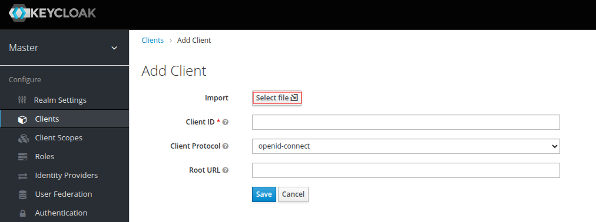
  * Update your rancher domain in `Client ID` section, select `Client Protocol` to `saml` ---> click on `save`.
    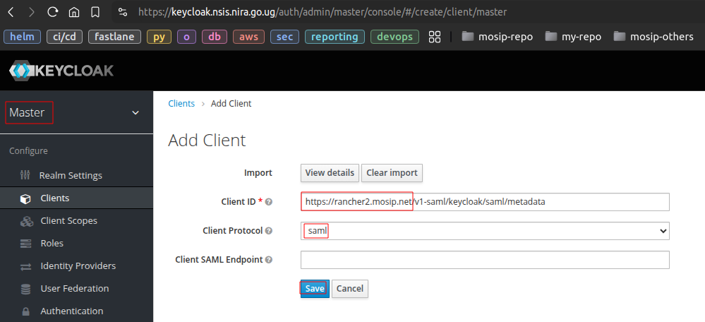
  * Navigate to the newly created saml client, Update domain in `Valid Redirect URIs` section. Ensure to enable the options provided in below images.
    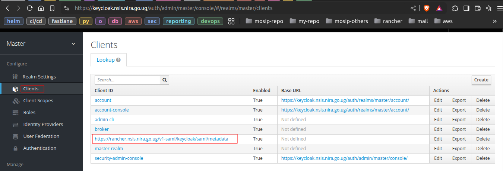
    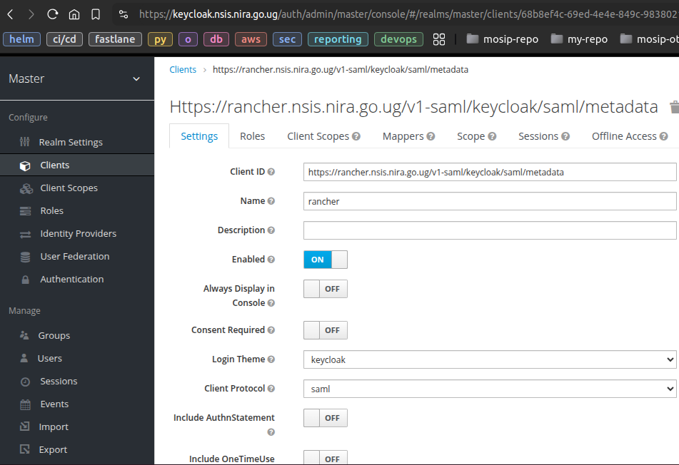 <br>
    
    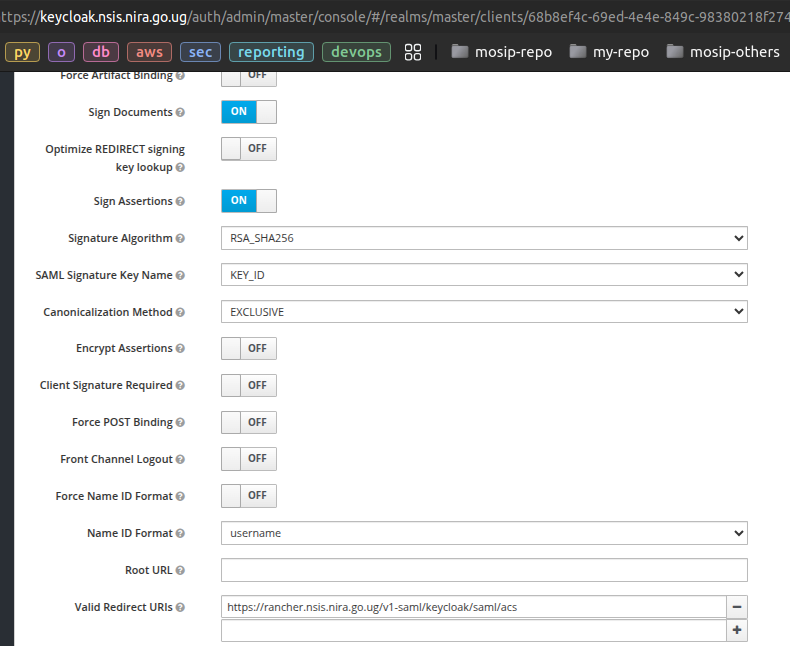
    
* Navigate to rancher dashboard ---> `Users & Authentication` ---> `Auth Provider` ---> `Keycloak (SAML)`.
  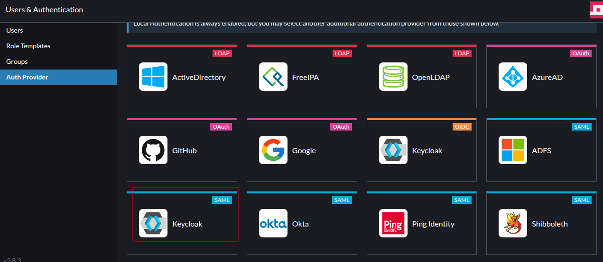
  * Specify the following mappings in Rancher's Authentication Keycloak form:
      * Display Name Field: givenName
      * Username Field: email
      * UID Field: username
      * Entity ID Field: https://your-rancher-domain/v1-saml/keycloak/saml/metadata
      * Rancher API Host: https://your-rancher-domain
      * Groups Field: member
  * Copy the content from keycloak url: https://keycloak-domain/auth/realms/master/protocol/saml/descriptor and provide it in rancher Auth provider `metadata.xml` field.<br>
    example: `https://keycloak.nsis.nira.go.ug/auth/realms/master/protocol/saml/descriptor`
  * For certificate: you can provide valid full chain ssl certificate & private key of `*.nsis.nira.go.ug` (ensure the certificate to be RSA type).
    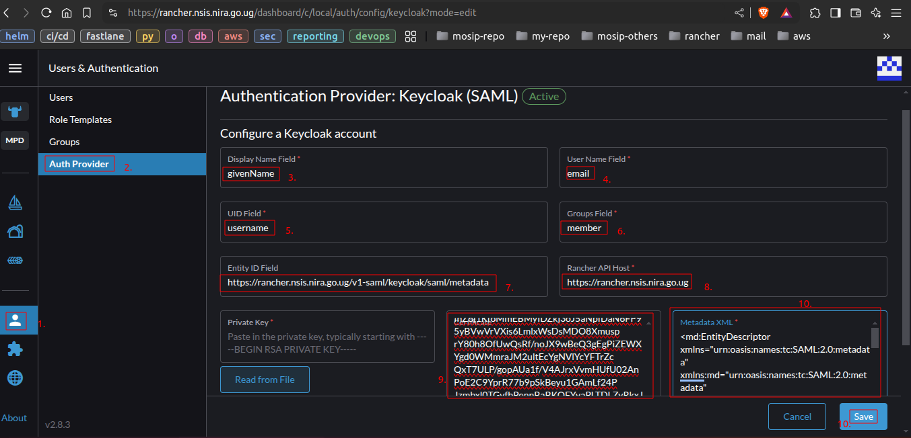
  * Click on `save`, it will pop up new window and click on `Login with Keycloak`
    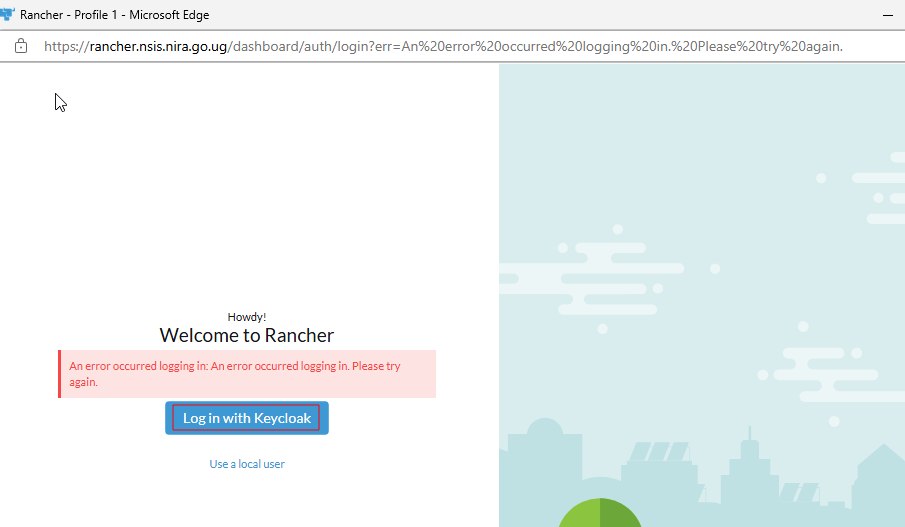
  * Once the login is successful, click on save. <br>
    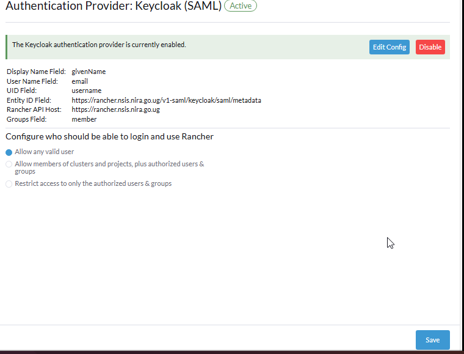

## Configuring SMTP and Login Settings in Keycloak

#### Login Settings
* Navigate to **Master Realm** → **Realm Settings** → **Login** → Enable the options provided in the below image:<br>
  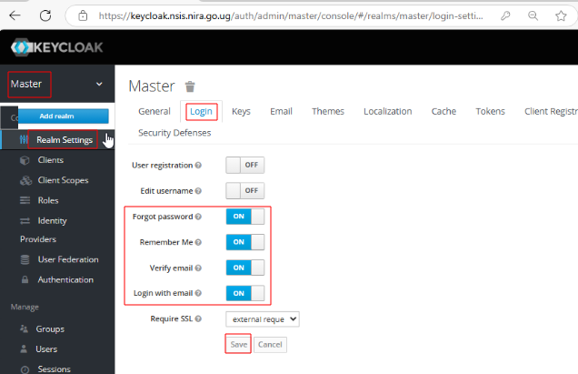
* Navigate to **Master Realm** → **Users** → **Search for admin user**.
  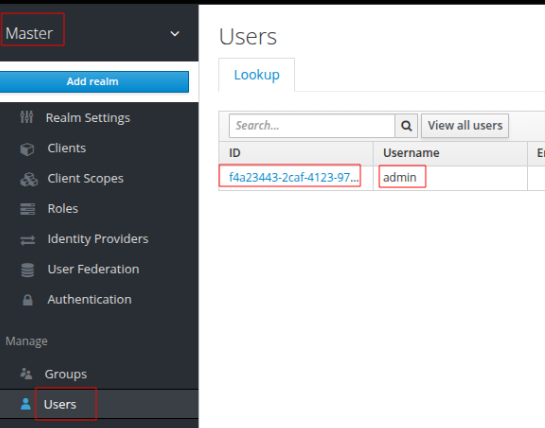
* Enable `Email Verified` option for admin user.<br>
  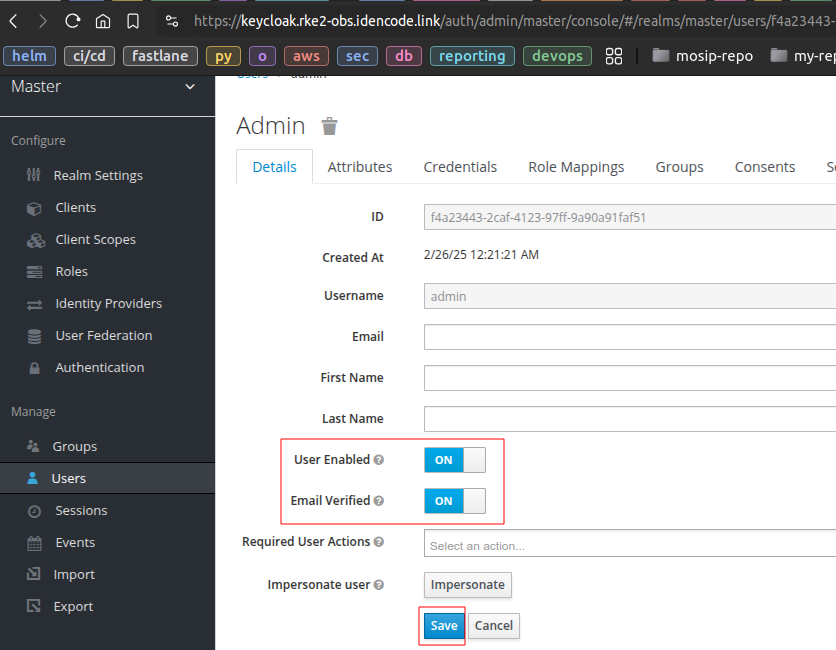

<br><br><br><br><br><br>

#### Configuring SMTP
To enable SMTP and login configurations in Keycloak, follow these steps:

* Before configuring SMTP, ensure that the Keycloak admin user has an email address, first name, and last name specified. Refer to the [integration guide](#integrate-keycloak-with-rancher-ui) for more details.
* Navigate to **Master Realm** → **Realm Settings** → **Email**.
* Enter the required SMTP details as shown in the image below:  
  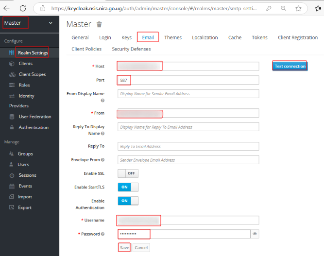
* Click **Save** to apply the settings.
* Click **Test Connection** to verify that Keycloak can successfully send emails.<br>
  This configuration ensures that Keycloak can send email notifications, such as password resets and account updates, to users.

<br><br><br><br><br><br><br><br><br><br><br><br><br><br><br><br>

## Monitoring deployment
* Navigate to the Monitoring directory:
  ```bash
  cd ~/k8s-infra/monitoring/
  ```
* Run `install.sh` to deploy monitoring application. Provide `local` as cluster-id user input variable.
  ```bash
  ./install.sh
  ....
  ....
  Please enter the env cluster-id: local
  ```
* To access Grafana dashboard, navigate to the cluster on Rancher Dashboard ---> `All namespace` ---> `Monitoring` ---> `Grafana Dashboards`.
  
* Use the below command to fetch the `admin` user password for grafana dashboard.
  ```bash
  kubectl -n cattle-monitoring-system get secret rancher-monitoring-grafana -o json | jq -r '.data."admin-password" | @base64d'
  ```

<br><br><br><br><br><br><br><br><br><br><br><br><br><br><br><br><br><br>

## Logging Deployment Guide

#### Deployment

1. Navigate to the Logging Directory.<br>
   Change to the logging directory before proceeding with the deployment:
   ```bash
   cd ~/k8s-infra/logging/
   ```

2. Modify the Installation Script.<br>
   Before running the installation script, update the following configurations:

    * **Comment out** the following lines in `install.sh` to disable Istio add-ons:
      ```bash
      # echo Install istio addons
      # helm -n $NS install istio-addons chart/istio-addons --set kibanaHost=$KIBANA_HOST --set installName=$KIBANA_NAME
      ```

    * **Update the Kibana Hostname** in `install.sh`:
      ```bash
      KIBANA_HOST=rancher-kibana.nsis.nira.go.ug
      ```

3. Deploy the Logging Operator.<br>
   Run the `install.sh` script to install the logging operator and associated applications:
   ```bash
   ./install.sh
   ```

4. Configure Kibana Ingress.<br>
   Update the Kibana hostname in `kibana-nginx-ingress.yaml`, then apply the updated configuration:
   ```bash
   kubectl apply -f kibana-ingress-rancher.yaml
   ```

5. Configure Elasticsearch Index Lifecycle Policy.<br>
   Modify the `./elasticsearch-ilm-script.sh` file as per your requirements.<br>
   Then, execute the script to apply the **Index Lifecycle Policy** and **Index Template** to Elasticsearch:
   ```bash
   ./elasticsearch-ilm-script.sh
   ```

#### **Configure Rancher Fluentd**
To collect logs, create **ClusterOutputs** as follows:

- Create an Elasticsearch ClusterOutput:
  ```bash
  kubectl apply -f clusteroutput-elasticsearch.yaml
  ```

- Create a ClusterFlow:
  ```bash
  kubectl apply -f clusterflow-elasticsearch.yaml
  ```

#### Dashboards Configuration

* Load Dashboards into Kibana.<br>
  Run the following command to import all dashboards from the `./dashboards` directory into Kibana:
  ```bash
  ./load_kibana_dashboards.sh ./dashboards <cluster-kube-config-file>
  ```
